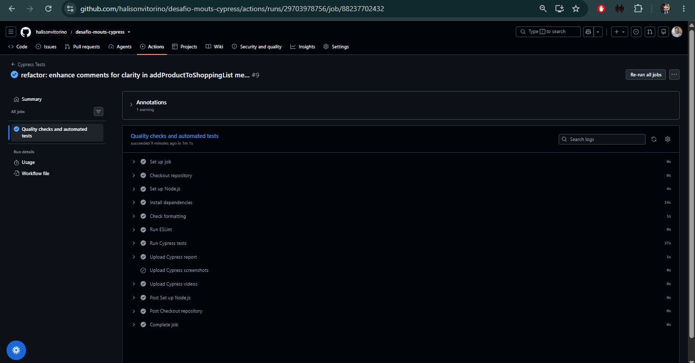
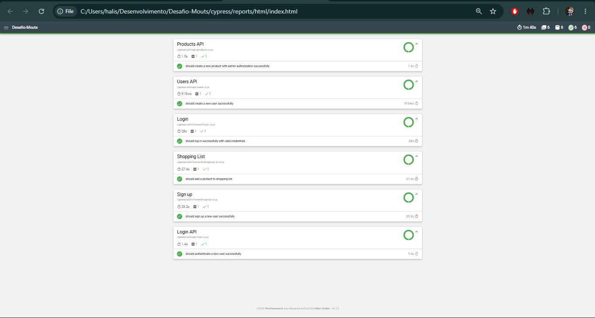
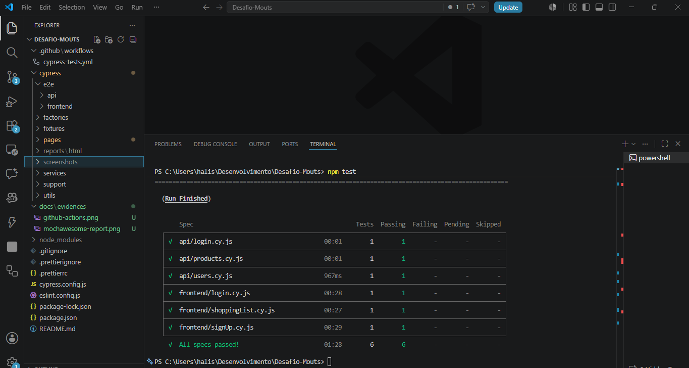

# ServeRest Test Automation Framework

## Overview

> Automated Frontend (E2E) and API tests using Cypress and JavaScript.


The project follows good automation practices such as:

- Page Object Model (POM)
- Service Layer
- Factory Pattern
- Dynamic test data
- ESLint
- Prettier
- GitHub Actions
- HTML Reports
- CI/CD pipeline
- Independent and reusable tests

---

## Application Under Test

### Frontend

- https://front.serverest.dev/

### API Documentation

- https://serverest.dev/

---

## Tech Stack

| Technology           | Version |
| -------------------- | ------- |
| Node.js              | 24.x    |
| Cypress              | 15.x    |
| JavaScript           | ES6+    |
| ESLint               | Latest  |
| Prettier             | Latest  |
| GitHub Actions       | Latest  |
| Mochawesome Reporter | Latest  |

---

## Project Structure

```text
.
├── .github
│   └── workflows
│       └── cypress-tests.yml
│
├── cypress
│   ├── e2e
│   │   ├── api
│   │   └── frontend
│   │
│   ├── factories
│   ├── fixtures
│   ├── pages
│   ├── services
│   ├── support
│   └── utils
│
├── .gitignore
├── .prettierrc
├── eslint.config.js
├── cypress.config.js
├── package.json
└── README.md
```

---

## Frontend Scenarios

### Login

- Create user through API.
- Authenticate using UI.
- Validate successful login.

### Sign Up

- Register a new user.
- Validate redirection.
- Validate authenticated session.

### Shopping List

- Dynamically select a product.
- Add product to shopping list.
- Validate product name and quantity.

---

## API Scenarios

### Users

- Create user.
- Validate persistence.
- Delete user.

### Login

- Authenticate valid user.
- Validate authorization token.

### Products

- Create product with authorization.
- Validate persistence.
- Delete product.

---

## Test Data Strategy

This project does not rely on static data.
Dynamic data is generated through Factory classes:

- UserFactory
- ProductFactory

Examples:

```javascript
const user = userFactory.createUser();

const product = productFactory.createProduct();
```

This approach guarantees:

- Independent tests.
- Reusability.
- Repeatable executions.
- No dependency on existing data.

---

## Installation

Clone the repository:

```bash
git clone https://github.com/halisonvitorino/desafio-mouts-cypress.git
```

Navigate to the project:

```bash
cd desafio-mouts-cypress
```

Install dependencies:

```bash
npm install
```

---

## Running Tests

### Run all tests

```bash
npm test
```

### Run Frontend tests

```bash
npm run test:frontend
```

### Run API tests

```bash
npm run test:api
```

### Open Cypress

```bash
npm run cy:open
```

---

## Code Quality

### Run ESLint

```bash
npm run lint
```

### Fix ESLint issues

```bash
npm run lint:fix
```

### Check formatting

```bash
npm run format:check
```

### Format project

```bash
npm run format
```

---

## Reports

HTML reports are automatically generated using:

- Cypress Mochawesome Reporter

Report location:

```text
cypress/reports/html/index.html
```

The report includes:

- Test execution summary
- Charts
- Execution time
- Screenshots
- Videos
- Passed and failed tests

---

## CI/CD

This project uses GitHub Actions.

Pipeline steps:

```text
Checkout repository
        ↓
Install dependencies
        ↓
Run Prettier
        ↓
Run ESLint
        ↓
Run Cypress tests
        ↓
Publish artifacts
```

Artifacts:

- HTML Report
- Videos
- Screenshots

---

## Evidence

### GitHub Actions



### Mochawesome Report



### Project Structure



---

## Future Improvements

- Docker support
- Parallel execution
- Test retries
- Test tagging
- Cross-browser execution
- Performance testing
- Dashboard integration

---

## Project Metrics

| Metric                | Value |
| --------------------- | ----- |
| Frontend Tests        | 3     |
| API Tests             | 3     |
| Total Automated Tests | 6     |
| CI/CD Pipeline        | Yes   |
| HTML Reports          | Yes   |
| Dynamic Test Data     | Yes   |
| Page Objects          | Yes   |
| Services              | Yes   |
| Factories             | Yes   |

---

## Author

Halison Vitorino

- QA Engineer / SDET
- Software Testing since 2015
- Automation: Cypress, Playwright, Selenium
- API Testing: Rest Assured, Postman
- CI/CD: GitHub Actions, Jenkins
- LinkedIn: https://www.linkedin.com/in/halisonvitorino
